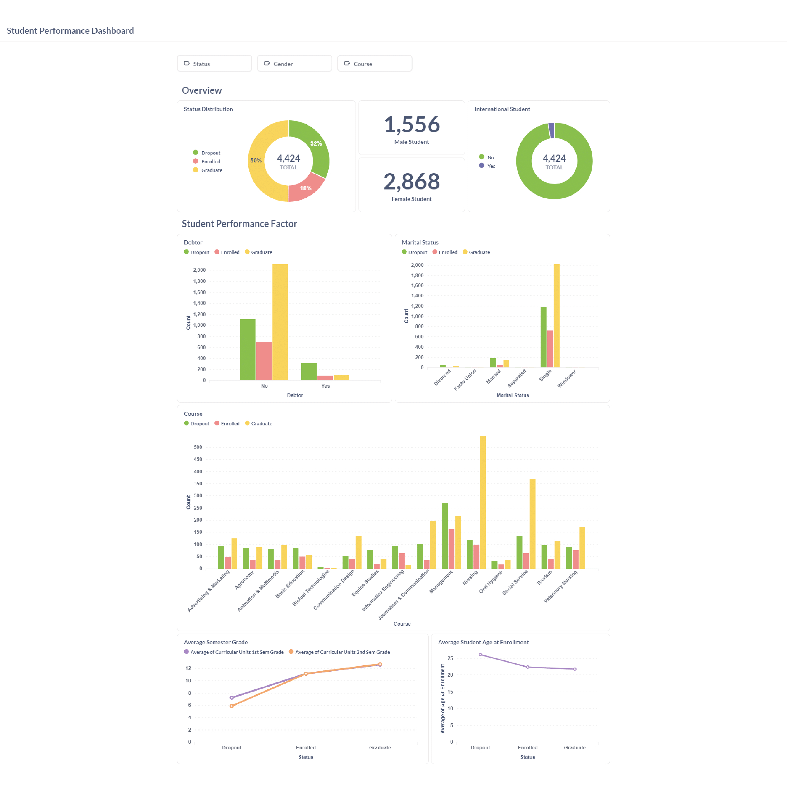
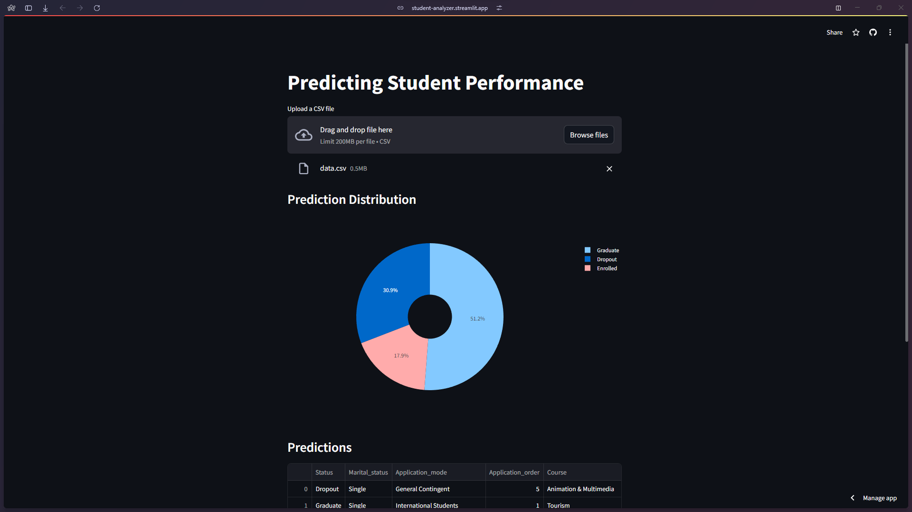

# Proyek Akhir: Menyelesaikan Permasalahan Jaya Jaya Institut

## Business Understanding
Jaya Jaya Institut merupakan salah satu institusi pendidikan tinggi yang telah berdiri sejak tahun 2000. Hingga saat ini, institusi ini telah mencetak banyak lulusan dengan reputasi yang sangat baik. Namun, terdapat banyak juga siswa yang tidak menyelesaikan pendidikannya alias dropout.

### Permasalahan Bisnis
Jumlah siswa yang tidak menyelesaikan pendidikan mereka atau dropout di Jaya Jaya Institut tergolong cukup tinggi, dan ini menjadi masalah besar bagi institusi pendidikan tinggi ini. Jumlah dropout yang tinggi dapat merusak reputasi Jaya Jaya Institut di mata calon siswa, orang tua, dan masyarakat umum. Reputasi yang baik sangat penting untuk menarik siswa baru dan mempertahankan kepercayaan publik. Tingginya dropout juga bisa menjadi indikasi bahwa ada masalah dalam sistem pendidikan atau dukungan yang diberikan kepada siswa. Hal ini perlu diatasi untuk memastikan kualitas pendidikan yang baik dan pengalaman belajar yang positif bagi semua siswa.

### Cakupan Proyek
Membuat sebuah aplikasi machine learning yang dapat memprediksi siswa yang akan melakukan dropout, membuat sebuah business dashboard yang dapat memberikan insight kepada pihak institusi, dan melakukan analisis terhadap faktor-faktor yang mempengaruhi siswa melakukan dropout. Data yang digunakan hanya data yang fokus pada faktor-faktor internal yang berada dibawah kendali langsung institusi pendidikan, daripada faktor eksternal seperti latar belakang orang tua.

### Persiapan

Sumber data: [GitHub](https://github.com/dicodingacademy/dicoding_dataset/tree/main/students_performance)
Hardware: GPU NVIDIA Volta™ or higher with compute capability 7.0+. ([list](https://developer.nvidia.com/cuda-gpus))<br>
Software:
- Docker
- Visual Studio Code

#### Setup environment:

Docker Container:
- Metabase Container: <u>metabase/metabase:v0.49.6</u> **(Docker Hub)**
- Rapids Notebook Container: <u>nvcr.io/nvidia/rapidsai/notebooks:24.04-cuda12.2-py3.11</u> **(Nvidia NGC)**

```bash
docker run -d -p 4000:3000 --name metabase metabase/metabase:v0.49.6

# Ubah parameter --gpus sesuai dengan GPU ID yang digunakan
docker run -d --name rapids-vs --gpus '"device=7"' -v ~/student_performance:/home/rapids/student_performance nvcr.io/nvidia/rapidsai/notebooks:24.04-cuda12.2-py3.11
```

Python Libraries:
```bash
# Notebook/Container Requirements
pip install -r container_requirements.txt

# Streamlit Dev Requirements
pip install -r requirements.txt
```

## Business Dashboard
```
# Metabase Account
Email: root@mail.com
Password: root123
```
### Dashboard Preview


### Penjelasan


## Machine Learning App
Aplikasi ini dibuat menggunakan Streamlit. Aplikasi sudah dilakukan deployment di Streamlit Cloud berikut urlnya [Streamlit](https://student-analyzer.streamlit.app/) 

Untuk menjalan aplikasi ini secara lokal, jalankan perintah berikut:
```bash
streamlit run app.py
```
### App Preview



## Conclusion
Berdasarkan analisis yang dilakukan terdapat beberapa faktor yang dapat mengindikan kelulusan/dropout pelajar pada Jaya Jaya Insitut. Beberapa faktor tersebut antara lain:
- Nilai
  - Siswa dengan nilai rendah pada semester awal cenderung lebih mungkin melakukan dropout. Secara spesifik, siswa dengan nilai rata-rata di bawah 8 pada semester satu dan 2 seringkali menunjukkan risiko tinggi untuk tidak menyelesaikan studi mereka. Nilai rendah ini dapat disebabkan oleh kurangnya pemahaman materi, kurangnya minat, atau masalah pribadi yang mengganggu proses belajar.
- Umur
  - Pelajar yang berumur lebih tua cenderung memiliki risiko dropout yang lebih tinggi. Biasanya, pelajar yang berusia di 25 tahun pada saat pendaftaran awal lebih mungkin menghadapi tantangan seperti kesibukan pekerjaan, tanggung jawab keluarga, atau kesulitan dalam menyesuaikan diri dengan lingkungan akademik yang baru.
- Kondisi Ekonomi
  - Kondisi ekonomi keluarga juga memainkan peran penting dalam kelulusan siswa. Analisis menunjukkan bahwa siswa yang berasal dari keluarga dengan kondisi ekonomi yang kurang baik cenderung lebih rentan terhadap dropout. Faktor-faktor seperti tingginya tingkat inflasi dan pengangguran juga mempengaruhi kemampuan keluarga dalam mendukung pendidikan anak mereka.

### Rekomendasi Action Items

- Bimbingan
  - Memberikan bimbingan khusus kepada pelajar yang mendapatkan nilai rata-rata dibawah 8 pada semester awal. Bimbingan ini bisa berupa bimbingan akademik, bimbingan psikologi, atau bimbingan lainnya.
  - Memberikan bimbingan khusus kepada pelajar yang berumur 25 tahun keatas. Bimbingan ini bisa berupa bimbingan akademik, bimbingan karir, atau bimbingan lainnya.
  > **Bimbingan Akademik**: Menyediakan sesi tambahan di luar jam kuliah reguler yang dipimpin oleh dosen atau tutor untuk membahas materi yang dianggap sulit. Sesi ini dapat dilakukan dalam bentuk kelas tambahan atau kelompok studi kecil.<br>
  > **Bimbingan Psikologi**: Menyediakan layanan konseling atau terapi psikologi bagi pelajar yang mengalami masalah pribadi atau emosional yang mengganggu proses belajar mereka.<br>
  > **Bimbingan Karir**:  Menyediakan informasi dan bimbingan mengenai karir dan peluang kerja bagi pelajar yang berusia lebih tua. Bimbingan ini dapat membantu pelajar untuk memahami peluang karir mereka setelah lulus dan memotivasi mereka untuk menyelesaikan pendidikan mereka.

- Beasiswa
  - Memberikan beasiswa kepada pelajar yang berasal dari keluarga dengan kondisi ekonomi yang kurang baik. Beasiswa ini bisa berupa beasiswa penuh, beasiswa sebagian, atau beasiswa lainnya. Beasiswa ini bisa membantu pelajar untuk tetap melanjutkan pendidikannya. Selain itu, beasiswa ini juga bisa membantu pelajar untuk fokus pada pendidikannya tanpa harus bekerja. Hal ini juga terbukti dengan analisis yang menunjukkan bahwa pelajar dengan beasiswa cenderung menyelesaikan pendidikannya.
